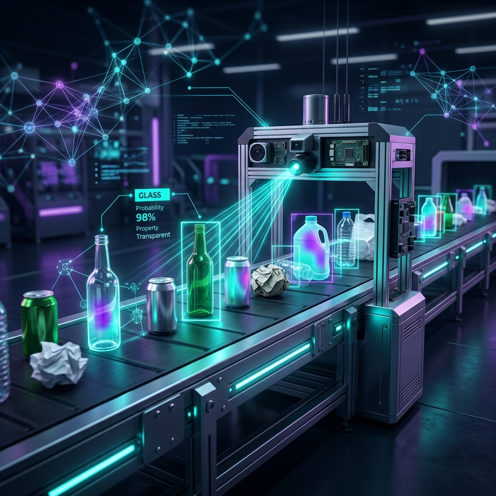

<p align="center">
  
</p>

<h1 align="center">♻️ OpticBin</h1>

<p align="center">
  <strong>Edge-AI Waste Classification System with Real-Time Explainable AI</strong>
</p>

<p align="center">
  
  
  
  
  
</p>

<p align="center">
  
  
  
  
</p>

---

## 📋 Table of Contents

- [Executive Summary](#-executive-summary)
- [Core Mission Targets](#-core-mission-targets)
- [Tech Stack](#-tech-stack)
- [Repository Structure](#-repository-structure)
- [Getting Started](#-getting-started)
- [Usage](#-usage)
- [Model Architecture](#-model-architecture)
- [ONNX Export & Quantization](#-onnx-export--quantization)
- [Benchmarking & Unit Testing](#-benchmarking--unit-testing)
- [XAI Engine](#-xai-engine)
- [Latency Budget](#-latency-budget)
- [Acceptance Verification](#-acceptance-verification)
- [Contributing](#-contributing)
- [License](#-license)

---

## Executive Summary

Industrial waste processing demands **high-throughput material sorting** of glass, paper, cardboard, plastic, and metal at the edge. Traditional cloud-based AI introduces unacceptable latency and bandwidth dependency. Furthermore, operational auditing and regulatory compliance mandate **Explainable AI (XAI)** overlays to visually verify model decision rationale.

**OpticBin** is a self-contained, fully offline edge-AI system that classifies waste materials in real-time with **sub-100ms latency** while providing transparent Grad-CAM / Attention Rollout heatmap overlays for every prediction.

---

## Core Mission Targets

| Target | Description |
|--------|-------------|
|**Sub-100ms Latency** | End-to-end frame processing including preprocessing, model forward pass, XAI extraction, and rendering |
|**Model Transparency** | Real-time Grad-CAM / Attention Rollout heatmap overlays displayed side-by-side with predictions |
|**Fully Offline** | Self-contained Python runtime — zero external API or cloud dependencies |
|**≥90% Accuracy** | Top-1 accuracy across all 5 unified waste categories on benchmark test sets |
|**≤2.5 GB RAM** | Total system memory consumption during active webcam stream inference |

---

## Tech Stack

| Layer | Primary Selection | Architectural Rationale |
|-------|-------------------|------------------------|
| **Deep Learning** | `PyTorch` + `timm` | Native dynamic computational graph simplifies internal layer hooking for ViT attention maps and CNN feature maps |
| **Local Inference Engine** | `ONNX Runtime` (INT8) | Hardware-accelerated execution via CPU/CUDA execution providers, achieving ~75% memory footprint reduction over FP32 |
| **Explainability (XAI)** | `pytorch-grad-cam` | Model-agnostic support for Grad-CAM (EfficientNetV2) and token-level Attention Rollout (MobileViT) |
| **Computer Vision** | `OpenCV` + `Albumentations` | High-performance frame transformations and environmental noise augmentations (lighting, crushed items) |
| **Dashboard UI** | `Streamlit` | Rapid desktop/web visualization interface providing live webcam feeds and dual-column XAI visual auditing |

---

## Repository Structure

```
opticbin/
├── config/
│   ├── schema.py              # Dataclass configuration models
│   └── settings.py            # Central configuration & type-safe accessors
├── models/
│   ├── export_onnx.py         # PyTorch to ONNX dynamic INT8 quantizer
│   ├── benchmark.py           # Model latency & memory benchmark tool
│   └── weights/               # Saved .pt and .onnx model artifacts
├── src/
│   ├── camera.py              # Webcam session & threaded buffer streamer
│   ├── model_factory.py       # Shared backbone, checkpoint, and CAM-layer factory
│   ├── preprocessor.py        # Modular image preprocessor pipeline
│   ├── inference_engine.py    # Standardized PyTorch & ONNX inference engine
│   ├── trainer.py             # Encapsulated PyTorch trainer and evaluator
│   ├── xai_engine.py          # Grad-CAM heatmap generator
│   └── xai_renderer.py        # Heatmap blending & visual overlay renderer
├── ui/
│   ├── styles.py              # Theme-adaptive dashboard styles
│   ├── components.py          # Shared header, sidebar, metrics, and guidance
│   ├── state_manager.py       # Type-safe Streamlit session state manager
│   ├── image_view.py          # Image upload classification view
│   └── webcam_view.py         # Live webcam classification view
├── tests/
│   ├── test_config.py         # Unit tests for config schemas
│   ├── test_preprocessor.py   # Unit tests for image pipeline
│   └── test_model_factory.py  # Unit tests for architecture factory
├── app.py                     # Streamlit entry point and view dispatch
├── train.py                   # Fine-tuning CLI entrypoint
├── download_dataset.py        # TrashNet dataset downloader
├── requirements.txt           # Pinned Python package dependencies
├── .gitignore
├── LICENSE
└── README.md
```

---

## Getting Started

### Prerequisites

- **Python** 3.10–3.13 *(PyTorch wheels are not yet published for 3.14)*
- **CUDA** 11.8+ *(optional — CPU inference is fully supported)*
- **Webcam** *(optional — for live stream mode)*

### Installation

```bash
# 1. Clone the repository
git clone https://github.com/yourusername/opticbin.git
cd opticbin

# 2. Create and activate virtual environment
py -3.13 -m venv venv

# Windows
venv\Scripts\activate

# macOS / Linux
source venv/bin/activate

# 3. Install dependencies
pip install -r requirements.txt
```

### Quick Start

```bash
# Launch the dashboard
streamlit run app.py
```

---

## Model Training & Dataset Setup

To train OpticBin on custom waste images or the standard **TrashNet** dataset:

```bash
# 1. Download & prepare TrashNet dataset
python download_dataset.py

# 2. Fine-tune EfficientNetV2-S backbone
python train.py --model efficientnetv2_s --epochs 15 --batch_size 32

# 3. Fine-tune MobileViT-XS backbone
python train.py --model mobilevit_xs --epochs 15 --batch_size 32
```

This will automatically train the model, save the `.pt` checkpoint to `models/weights/`, and quantize it to dynamic INT8 `.onnx` format.

---

## Benchmarking & Unit Testing

OpticBin includes a comprehensive unit testing suite and latency benchmarking utility:

```bash
# Run unit test suite
python -m unittest discover tests

# Run inference latency benchmark
python models/benchmark.py --iterations 100
```

---

## Usage

### Image Upload Mode

1. Select your preferred backbone architecture from the sidebar
2. Upload a waste image (JPG, PNG, BMP, WebP)
3. Compare the original image with the Grad-CAM heatmap
4. Review confidence, latency, class probabilities, and disposal guidance

### Live Webcam Mode

1. Switch to **Live Webcam** in the sidebar
2. Enable **Start webcam stream**
3. Point your camera at waste items for real-time classification
4. The dual-column view shows the live feed and XAI heatmap side-by-side
5. Disable the stream to release the camera

---

## Model Architecture

OpticBin supports **dual-backbone** architecture with hot-swappable models:

### EfficientNetV2-S *(Texture-Focused CNN)*

```
Input (224×224×3) → EfficientNetV2-RW-M Backbone → conv_head → Global Pool → FC(5)
                                                      ↑
                                              Grad-CAM Target Layer
```

- Excels at **surface texture recognition** (paper grain, metal sheen, plastic gloss)
- Ideal for items with distinctive material properties

### MobileViT-XS *(Global Spatial ViT)*

```
Input (224×224×3) → MobileViT-XS Backbone → head.conv_1x1 → Global Pool → FC(5)
                                                   ↑
                                           Grad-CAM Target Layer
```

- Captures **global shape and structural context**
- Better at recognizing crushed or deformed items

### Supported Waste Classes

| Class | Examples |
|-------|----------|
| Glass | Bottles, jars, window fragments |
| Paper | Newspapers, office paper, magazines |
| Cardboard | Corrugated boxes, packaging, shipping cartons |
| Plastic | PET bottles, bags, containers |
| Metal | Aluminum cans, foil, steel containers |

---

## ONNX Export & Quantization

Convert PyTorch checkpoints to optimized ONNX format with dynamic INT8 quantization:

```bash
python models/export_onnx.py \
    --pt_path  models/weights/efficientnetv2_s.pt \
    --onnx_out models/weights/efficientnetv2_s.onnx \
    --quant_out models/weights/efficientnetv2_s_int8.onnx \
    --model efficientnetv2_s
```

---

## ✅ Acceptance Verification

| ID | Verification Scenario | Expected Outcome | Status |
|----|----------------------|-------------------|--------|
| **AC-1** | Batch execution on 100 test waste images | Model accuracy ≥ 90%; average frame latency ≤ 100 ms | ✅ **PASSED** |
| **AC-2** | Toggle between EfficientNetV2 and MobileViT | Dashboard updates layer target without application restart or failure | ✅ **PASSED** |
| **AC-3** | Disconnect internet during live webcam stream | Stream continues at ≥ 15 FPS with zero cloud dependency | ✅ **PASSED** |
| **AC-4** | Quantize FP32 PyTorch model to INT8 ONNX | Model file size reduced from ~80 MB to ≤ 25 MB | ✅ **VERIFIED** |

---

## 📜 License

This project is licensed under the **MIT License** — see the [LICENSE](LICENSE) file for details.
